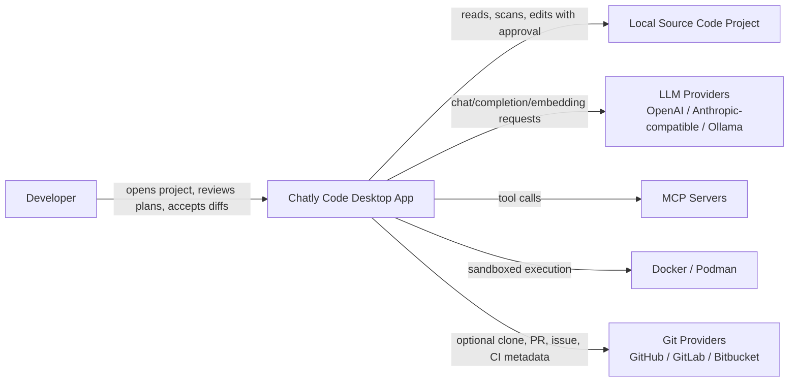
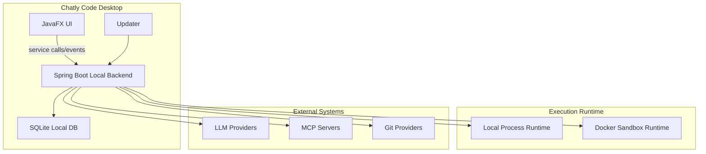
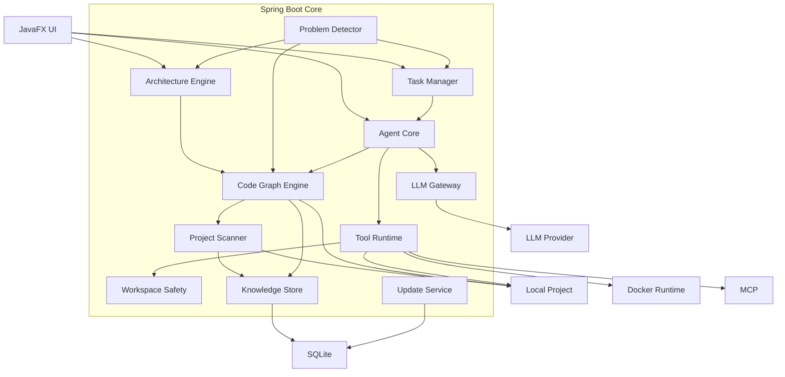
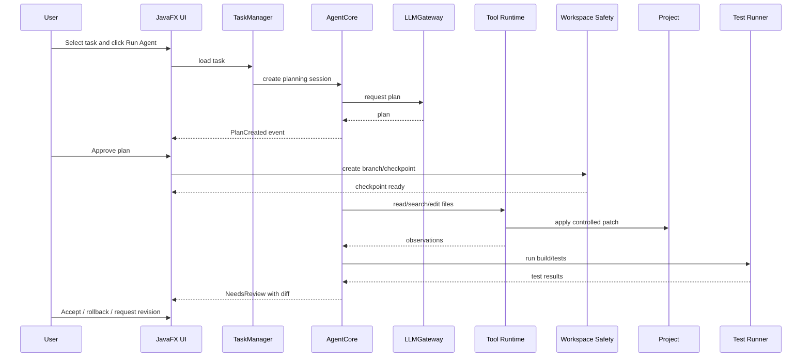

# C4 Architecture

Этот документ описывает C4-архитектуру самого Chatly Code.

## C1: System Context



## C2: Containers



## C3: Spring Boot Backend Components



## C4: Agent Task Code-Level Flow



## C4 generation for user projects

Для открытого пользовательского проекта Chatly Code должен генерировать:

- C1 System Context.
- C2 Containers.
- C3 Components.
- C4 Code-level relationships.

Файлы:

```text
docs/architecture/c4-context.md
docs/architecture/c4-containers.md
docs/architecture/c4-components.md
docs/architecture/c4-code.md
```

## Architecture Node Model

Каждый узел C4 должен иметь:

- id;
- name;
- type: system/container/component/code;
- technology;
- description;
- source files;
- incoming dependencies;
- outgoing dependencies;
- detected problems;
- linked tasks.

## C4 UX

C4 не должен быть просто картинкой. Это navigation surface:

```text
Diagram node -> files -> dependencies -> problems -> tasks -> agent fix
```

## Code Graph Backbone

C4-модель строится поверх локального code graph:

```text
CodeNode(file/class/method/route/component)
-> CodeEdge(contains/imports/calls/references/implements/extends)
-> ArchitectureNode(system/container/component/code)
-> C4 diagram
```

Правило: C4 должен опираться на deterministic evidence из AST/resolver, а LLM используется для описаний и группировки только после того, как есть фактический граф.
